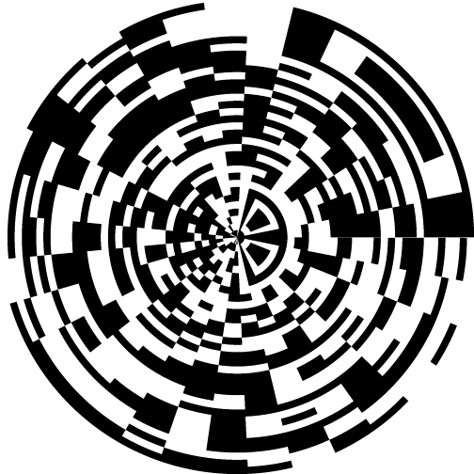
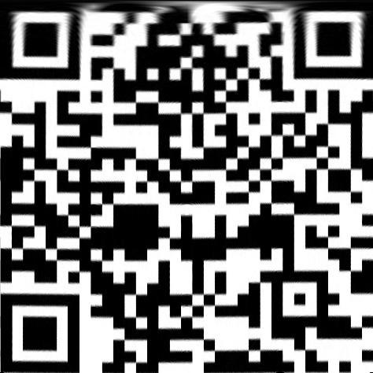
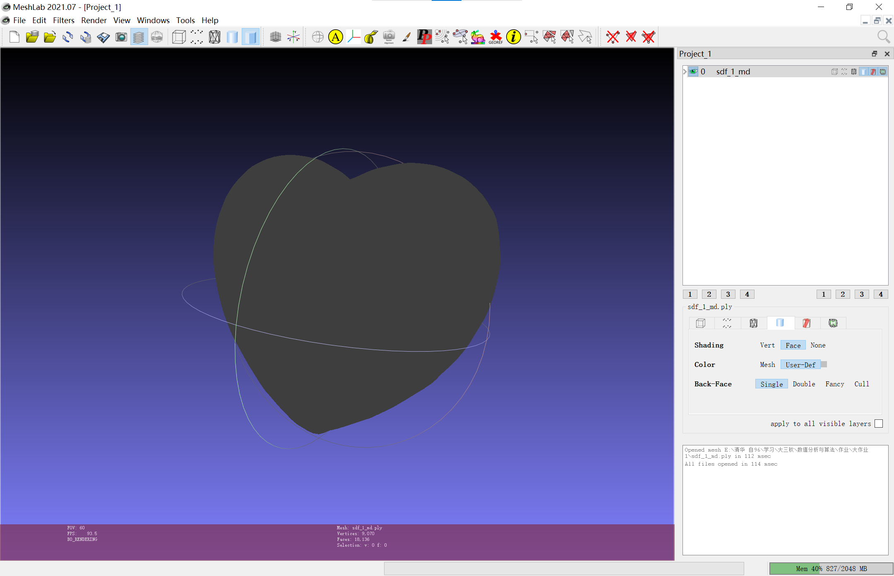
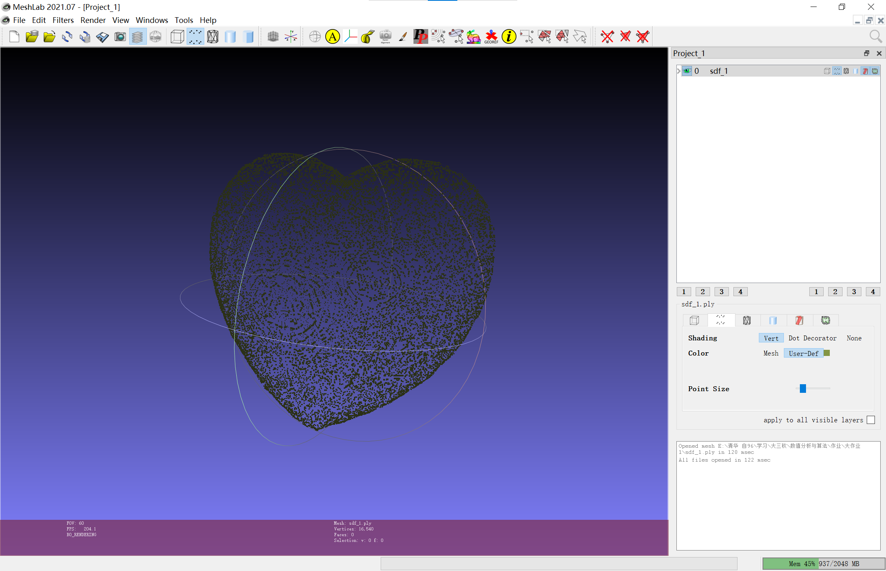
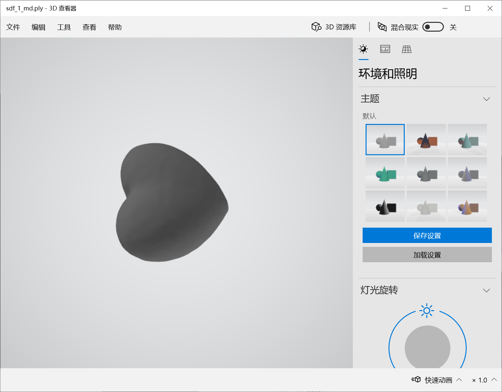

<h1  align = "center" >数值分析与算法 第一次大作业 </h1>

<h6 align = "center">自96 曲世远 2019011455</h6>

## 双线性插值

#### 完成思路

本题给出了一幅通过坐标变换得到的二维码。首先，由于给出的图片为$.png$格式，且包含有$alpha$通道，不便于通过矩阵处理，因此我先通过图像处理软件将其转换为了$.jpg$格式，再将图片读入，依据给定公式进行双线性插值。

#### 数学推导

根据题目中给定的坐标系，遍历直角坐标二维码图中的每个像素，先将像素值转化为坐标值，并映射为极坐标系中的$r, \theta$：
$$
r = x / length \times 2\pi\\
\theta = y / length \times 2\pi\\
$$

再将$r，\theta$转化得到极坐标二维码图中的像素下标：
$$
x_0 = (2\pi + r\cos\theta) \times length / 4\pi\\
y_0 = (2\pi - r\sin\theta) \times length / 4\pi\\
$$
之后找到该下标附近的像素点及像素值根据双线性插值的公式进行计算即可。
$$
\because x_1 - x_0 = 1, y_1 - y_0 = 1\\
\begin{align}
\therefore f(x, y) = &(x - x_0) \times ((y - y_0)\times f(x_0, y_1) + (y_1 - y) \times f(x_0, y_0)) + \\
& (x_1 - x) \times ((y - y_0) \times f(x_1, y_1) + (y_1 - y) \times f(x_1, y_0))
\end{align}
$$

#### 误差分析

本题的**方法误差**主要是直角坐标系下的二元函数的双线性插值的误差，方法误差如下：

设$g(u, v)$为给定的数据值，$f(p) = f(x, y)$为插值得到的结果。其中$ u \le x \le u + 1$, $v \le y \le v + 1$
$$
|R(x, y)_x|  \le \frac{1}{2}max|\frac{\partial^2 g}{\partial x^2}|\cdot |(x - u)(x - u - 1)| \le \frac{1}{8}max|\frac{\partial^2 g}{\partial x^2}|\\
|R(x, y)_y|  \le \frac{1}{2}max|\frac{\partial^2 g}{\partial y^2}|\cdot |(y - v)(y - v - 1)| \le \frac{1}{8}max|\frac{\partial^2 g}{\partial y^2}|\\
\therefore R \le |R(x, y)_x + R(x, y)_y| \le \frac{1}{8}(max|\frac{\partial^2 g}{\partial x^2}| + max|\frac{\partial^2 g}{\partial y^2}|)\\
\because max|\frac{\partial^2 g}{\partial x^2}| = M, max|\frac{\partial^2 g}{\partial y^2}| = M\\
\therefore R \le \frac{1}{4}M
$$
**舍入误差**如下：

将二维码图像插值得到每个点的像素之后保存为RGB图像需要转化为8精度的整型变量，因此会损失精度，带来的舍入误差为：$R \le \frac{1}{2}$

计算过程中也可能产生舍入误差，不过由于我在计算过程中使用的是double类型的数据字长为63位，所能产生的误差大小远小于存储数据时数据类型转换带来的舍入误差，因此可以忽略不计。

总误差界即为方法误差与舍入误差之和。

#### 作图结果

> 我生成的二维码图片应当是原图的xy轴交换后的结果，因为我使用了PIL库的保存图片的函数，其定义的XY轴与本题所使用的不同

## 三线性插值

#### 完成思路

本题给出了等距分布的sdf函数值，通过坐标映射就可以找到这些函数值对应的坐标，之后通过精细划分采样的方法进行三线性插值计算sdf的值，在与阈值作比较就可以得到近似可认为处于表面的点的坐标，从而得到表面点坐标。

不过，上述算法用于需要对坐标进行等距遍历并计算三线性插值，计算效率不高，精度有限，我再经过分析与结合sdf知识想到了**一个精妙的算法**，不过由于我早已完成了本次作业的代码以及期中考试时间紧迫，我没来得及实现这一精妙的想法，不过我将它介绍给我的好朋友后，我的同学将它实现了出来并得到了很好的效果，想法如下：

考虑给定数据中的紧邻八个数据点构成的一个小方块，一定可以知道这八个数据点的sdf函数值是否同号，而如果这八个点的sdf值符号相同，那么表明当前方块内部的点全部位于表面的同侧，无需计算直接跳过即可，只有出现了不同号的情况是再在方块内部进行精细划分计算sdf即可。这样做会使得大量的无效计算（肯定不是表面点）被直接跳过，而有效计算又是在极小的方块内进行，所以精度与效率均可以得到极大的改善。

同时，由于取点是在边界小方格内均匀进行，因此也比沿坐标轴均匀去点得到的结果更美观更精确。

#### 数学推导

本题只需要进行像素到数值的坐标映射即可，不像上题需要进行坐标系的转换映射较为复杂，故不在此后附坐标转换公式，下为三线性插值的公式：
$$
\because x_1 - x_0 = 1, y_1 - y_0 = 1， z_z - z_0 = 1\\
\begin{align}
\therefore f(x, y, z) = &(x_1 - x)(y_1 - y)(z_1 - z)f(x_0, y_0, z_0) + (x_1 - x)(y_1 - y)(z - z_0)f(x_0, y_0, z_1)\\
+&(x_1 - x)(y - y_0)(z_1 - z)f(x_0, y_1, z_0) + (x - x_0)(y_1 - y)(z_1 - z)f(x_1, y_0, z_0)\\
+&(x_1 - x)(y - y_0)(z - z_0)f(x_0, y_1, z_1) + (x - x_0)(y - y_0)(z_1 - z)f(x_1, y_1, z_0)\\
+&(x - x_0)(y_1 - y)(z - z_0)f(x_1, y_0, z_1) + (x - x_0)(y - y_0)(z - z_0)f(x_1, y_1, z_1)\\
\end{align}
$$

#### 误差分析

本题的误差主要来源于方法误差与舍入误差：

**方法误差**如下：

类似于双线性插值,且假设相同时，我们不难由双线性插值的误差公式类推出三线性插值的误差公式，分析如下：

双线性插值与三线性插值均为线性插值计算，具有线性性，而在进行误差分析时，均使用的是对所求点附近泰勒展开的方式。由双线性插值的计算过程可知，偏导的交叉项与一次项均可以与固定值约去，因此均只保留了二阶偏导项，由此推知，三线性插值的**方法误差界**为：
$$
R \le \frac{1}{8}M + \frac{1}{4} = \frac{3}{8}M
$$
**舍入误差**如下：

同上问的分析结论，计算过程中由于python的数据位长足够，因此计算中的舍入误差可以被充分忽略，因而可以只考虑保存文件过程中产生的舍入误差，观察sdf文件，发现保留了9位有效数字，因此舍入误差$\Delta_0 = \frac{1}{2} \times 10^{-8}$

由插值公式计算由于原始数据的舍入带来的舍入误差：
$$
R_2 \le p^{-3} \times p^3\times\Delta_0 = \frac{1}{2}\times10^{-8}
$$
总误差界即为方法误差与舍入误差之和

#### 作图结果

## 最小二乘法

#### 完成思路

由于本体只需要计算两个参数的最小二乘结果，因此可以将其他变量划归为x‘， y'从而使用最小二乘公式快速的计算得到结果。

#### 数学推导

$$
（2x^2 + y^2 + z^2 - 1)^3 + ax^2z^3 + by^2z^3 = 0\\
-\frac{(2x^2 + y^2 + z^2 - 1)^3}{y^2z^3} = a\frac{x^2}{y^2} + b\\
\therefore x' = \frac{x^2}{y^2}, y' = -\frac{(2x^2 + y^2 + z^2 - 1)^3}{y^2z^3}
$$

使用最小二乘法公式：
$$
a = \frac{\sum^n_1(x_i - \bar{x})(y_i - \bar{y})}{\sum^n_1(x_i - \bar{x})^2}\\
b = \frac{\bar{x}}{\bar{y}}\\
$$
使用上一问得到的数据进行计算，并舍去在进行x’，y'计算中出现的极值后得到计算结果：

$a = -0.099849, b = -1.001058$

