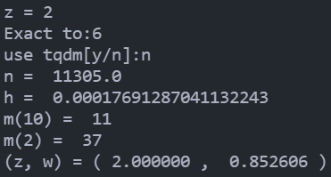

<h1  align = "center" >数值分析与算法 第一次大作业 </h1>

<h6 align = "center">自96 曲世远 2019011455</h6>

## 数值法解微分方程

#### 完成思路

基于改进欧拉公式及其误差公式，可以依据给定的误差要求与自变量值得到迭代次数$n$与每次迭代中的保留精度$\frac{1}{2}\times10^{-m}$。基于上述参数就可以根据改进欧拉的公式进行微分方程迭代求解，基于此求得的解一定满足给出的精度要求，同时也一定能够实现对任意精度的求解。

#### 数学推导

1. 首先计算$W'(z)$

$$
z = f(w) = we^w\\
w = W(z)\\
对上式两侧对z求导，可得：\\
1 = \frac{\mathrm{d} w}{\mathrm{d} z} \cdot e^w + \frac{\mathrm{d} w}{\mathrm{d} z}\cdot we^w\\
\frac{\mathrm{d} w}{\mathrm{d} z} = \frac{1}{e^w + z}\\
\because e^w + z = (1 + w)e^w \neq 0, \ w \neq -1, \ z \neq -\frac{1}{\mathrm{e}}\\
\therefore W'(z) = \frac{1}{z + e^{W(z)}}, \ z \neq -\frac{1}{\mathrm{e}}\\
$$

2. 对于任意给定的$z > 0$，根据上面的推到的结果以及初始条件$W_0(0) = 0$，利用微分方程的数值解法，以**任意精度**求解$W_0(z)$，需要同时考虑方法误差和舍入误差。

$$
w' = f(z, w) = \frac{1}{z + e^w}\\
以x表示精确到小数点后第x位，则有总误差e \leq \frac{1}{2} \times 10^{-x}\\
以w^*表示待求解的值，给定的z = z^*，则有W(z^*) = w^*\\
所以z从z_0 = 0迭代至z_n = z^*, n = \frac{z^*}{h}, h = \frac{z^*}{n}\\
先计算导数上界\\\begin{align}
|\frac{\partial f}{\partial w}|  &= |\frac{e^w}{(z + e^w)^2}| \leq  |\frac{1}{(1 + 0)^2} = 1 = M\\
|W''(z)| &= |\frac{(2 + w)}{(1 + w)^3\cdot e^{2w}}| \leq |\frac{(2 + 0)}{(1 + 0)^3\cdot e^{0}}| \leq 2 = L \\
|W^{(3)}(z)| &=  |\frac{(2w^2 + 8w + 9)}{(1 + w)^5\cdot e^{3w})} | \leq |\frac{(2w^2 + 8w + 9)}{(1 + w)^5\cdot e^{3w})} | \leq |\frac{(0 + 9)}{(1 + 0)^5\cdot e^{0})} | \leq 9 = T \\ 
\end{align}
$$

$$
根据改进欧拉法的方法误差：\Delta_{n + 1} \leq (1 + hM + \frac{h^2 + M ^ 2}{2})\Delta_n + (\frac{ML}{4} + \frac{T}{12})h^3\\
\therefore \Delta_{n + 1} + \frac{1}{hM + \frac{h^2M^2}{2}}(\frac{ML}{4} + \frac{T}{12})h^3 \\ \leq (1 + hM + \frac{h^2M^2}{2})[\Delta_n + \frac{1}{hM + \frac{h^2M^2}{2}}(\frac{ML}{4} + \frac{T}{12})h^3] \leq ... \\
\leq (1 + hM + \frac{h^2M^2}{2})^{n + 1}[\Delta_0 + \frac{1}{hM + \frac{h^2M^2}{2}}(\frac{ML}{4} + \frac{T}{12})h^3]\\
根据改进欧拉法的舍入误差：\delta_{n+ 1} \leq (1 + hM + \frac{h^2M^2}{2})\delta_n + (1 + \frac{hM}{2})\cdot \frac{1}{2}\cdot 10^{-m}\\
\therefore \delta_{n + 1} + \frac{1}{hM + \frac{h^2M^2}{2}}(1 + \frac{hM}{2})\cdot \frac{1}{2}\cdot 10^{-m}\\
\leq (1 + hM + \frac{h^2M^2}{2})[\delta_n +  \frac{1}{hM + \frac{h^2M^2}{2}}(1 + \frac{hM}{2})\cdot \frac{1}{2}\cdot 10^{-m}] \leq ... \\
\leq (1 + hM + \frac{h^2M^2}{2})^{n + 1}[\delta_0 +  \frac{1}{hM + \frac{h^2M^2}{2}}(1 + \frac{hM}{2})\cdot \frac{1}{2}\cdot 10^{-m}]
$$

$$
因为整体误差e \leq \frac{1}{2} \times 10^{-x}，所以不妨令：\\
\delta_{n } \leq \frac{1}{4} \times 10^{-x}, \ \Delta_n \leq \frac{1}{4} \times 10^{-x}\\
\therefore 
\left\{
\begin{align}
 [(1 + hM + \frac{h^2M^2}{2})^{n} &- 1][\frac{1}{hM + \frac{h^2M^2}{2}}(\frac{ML}{4} + \frac{T}{12})h^3] \\
 &\approx (e^{z^*M} - 1)\frac{h^2}{M + \frac{hM^2}{2}}(\frac{ML}{4} + \frac{T}{12})
 \leq \frac{1}{4} \times 10^{-x}\\
[(1 + hM + \frac{h^2M^2}{2})^{n} &- 1][\frac{1}{hM + \frac{h^2M^2}{2}}(1 + \frac{hM}{2})\cdot \frac{1}{2}\cdot 10^{-m}] \\
&\approx (e^{Z^*M} - 1)\frac{1}{hM}\cdot \frac{1}{2} \cdot 10^{-m}
\leq \frac{1}{4} \times 10^{-x}\\

\end{align}\\
\right.\\
$$

$$
其中，M = 1, L = 2, T = 9, h = \frac{z^*}{n}\\
\therefore \left\{
\begin{align}
&由1.25\times(e^{z^*} - 1)\frac{{z^*}^2}{n^2} \leq 0.25 \times 10^{-x}解得n的值（向上取整）\\
&由n的值及2\times(e^{z^*} - 1)\frac{n}{z^*}\times10^{x} \leq 10^{m}解得m的值（向上取整）\\
\end{align}
\right.\\
根据解出的n, m即可得到应当进行多少次迭代以及每次迭代后保留多少位有效数字，\\
由上述推到过程可知，基于上述的n, m得到的微分方程的解一定满足要求的精度\frac{1}{2}\times10^{-x}
$$

$$
基于上述过程求得的参数，利用如下所示的改进欧拉法解微分方程：\\
\left\{
\begin{align}
\bar{w}_{n +1} &= w_n + h\cdot f(w, z)\\
w_{n + 1} &= w_n + \frac{h}{2}[f(w_{n}, z_{n}) + f(\bar{w}_{n + 1}, z_{n + 1})]
\end{align}
\right.
$$

#### 误差分析

见数学推导部分。

#### 结果

当$z = 2$时，求得的$w = 0.852606$

## 求解定积分

#### 完成思路

本题要求进行两个定积分的求解，对于第一个定积分，可以先找到原函数后在进行

#### 数学推导

1. 求$\int_0^aW_0(z)\mathrm{d}z$

$$
\begin{align}
\int_0^aW_0(z)\mathrm{d}z &=  \int_0^{W_0(a)}w\mathrm{d}we^w \\
& = \left.w^2e^w\right|_0^{W_0(a)} - \int_0^{W_0(a)}we^w\mathrm{d}w\\
& = \left.w^2e^w\right|_0^{W_0(a)} - \left.e^w(w - 1)\right|_0^{W_0(a)}\\
& = \left. e^w(w^2 - w + 1) \right|_0^{W_0(a)}\\
& = e^{W_0(a)}(W_0(a)^2 - W_0(a) + 1) - 1
\end{align}
$$

下面进行误差分析：
$$
A = \int_0^aW_0(z)\mathrm{d}z =e^{W_0(a)}(W_0(a)^2 - W_0(a) + 1) - 1\\
\Delta A = |\frac{\mathrm{d}f}{\mathrm{d}W_0(a)}| = |e^{W_0(a)}(W_0(a)^2 + W_0(a))|\cdot |\Delta W_0(a)|
$$

$$
\Delta A = \frac{1}{2} \times 10^{-x}\\
$$

#### 误差分析

本题的误差主要来源于方法误差与舍入误差：

**方法误差**如下：

类似于双线性插值,且假设相同时，我们不难由双线性插值的误差公式类推出三线性插值的误差公式，分析如下：

双线性插值与三线性插值均为线性插值计算，具有线性性，而在进行误差分析时，均使用的是对所求点附近泰勒展开的方式。由双线性插值的计算过程可知，偏导的交叉项与一次项均可以与固定值约去，因此均只保留了二阶偏导项，由此推知，三线性插值的**方法误差界**为：
$$
R \le \frac{1}{8}M + \frac{1}{4} = \frac{3}{8}M
$$
**舍入误差**如下：

同上问的分析结论，计算过程中由于python的数据位长足够，因此计算中的舍入误差可以被充分忽略，因而可以只考虑保存文件过程中产生的舍入误差，观察sdf文件，发现保留了9位有效数字，因此舍入误差$\Delta_0 = \frac{1}{2} \times 10^{-8}$

由插值公式计算由于原始数据的舍入带来的舍入误差：
$$
R_2 \le p^{-3} \times p^3\times\Delta_0 = \frac{1}{2}\times10^{-8}
$$
总误差界即为方法误差与舍入误差之和

#### 作图结果

