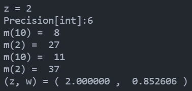
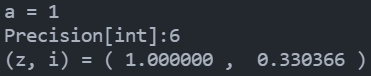
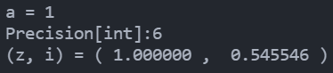

<h1  align = "center" >数值分析与算法 第二次大作业 </h1>

<h6 align = "center">自96 曲世远 2019011455</h6>

## 数值法解微分方程

#### 完成思路

基于改进欧拉公式及其误差公式，可以依据给定的误差要求与自变量值得到迭代次数$n$与每次迭代中的保留精度$\frac{1}{2}\times10^{-m}$。基于上述参数就可以根据改进欧拉的公式进行微分方程迭代求解，基于此求得的解一定满足给出的精度要求，同时也一定能够实现对任意精度的求解。

需要注意的是使用的`gmpy2`高精度库中只可以设置有效数字的准确位数（不考虑小数点时），因此为了得到精确到小数点后第`x`位的结果，需要先估计计算结果中整数部分的位数并增加设置的有效数字的长度。在实际编程中，我采用了先估算出精度较低的`w`值后对其整数部分向`2`的指数部分上取整，再计算这部分整数需要的有效位数，再修正计算过程中的精确位数得到满足要求的任意精度结果。

#### 数学推导

1. 首先计算$W'(z)$

$$
z = f(w) = we^w\\
w = W(z)\\
对上式两侧对z求导，可得：\\
1 = \frac{\mathrm{d} w}{\mathrm{d} z} \cdot e^w + \frac{\mathrm{d} w}{\mathrm{d} z}\cdot we^w\\
\frac{\mathrm{d} w}{\mathrm{d} z} = \frac{1}{e^w + z}\\
\because e^w + z = (1 + w)e^w \neq 0, \ w \neq -1, \ z \neq -\frac{1}{\mathrm{e}}\\
\therefore W'(z) = \frac{1}{z + e^{W(z)}}, \ z \neq -\frac{1}{\mathrm{e}}\\
$$

2. 对于任意给定的$z > 0$，根据上面的推到的结果以及初始条件$W_0(0) = 0$，利用微分方程的数值解法，以**任意精度**求解$W_0(z)$，需要同时考虑方法误差和舍入误差。

$$
w' = f(z, w) = \frac{1}{z + e^w}\\
以x表示精确到小数点后第x位，则有总误差e \leq \frac{1}{2} \times 10^{-x}\\
以w^*表示待求解的值，给定的z = z^*，则有W(z^*) = w^*\\
所以z从z_0 = 0迭代至z_n = z^*, n = \frac{z^*}{h}, h = \frac{z^*}{n}\\
先计算导数上界\\\begin{align}
|\frac{\partial f}{\partial w}|  &= |\frac{e^w}{(z + e^w)^2}| \leq  |\frac{1}{(1 + 0)^2} = 1 = M\\
|W''(z)| &= |\frac{(2 + w)}{(1 + w)^3\cdot e^{2w}}| \leq |\frac{(2 + 0)}{(1 + 0)^3\cdot e^{0}}| \leq 2 = L \\
|W^{(3)}(z)| &=  |\frac{(2w^2 + 8w + 9)}{(1 + w)^5\cdot e^{3w})} | \leq |\frac{(2w^2 + 8w + 9)}{(1 + w)^5\cdot e^{3w})} | \leq |\frac{(0 + 9)}{(1 + 0)^5\cdot e^{0})} | \leq 9 = T \\ 
\end{align}
$$

$$
根据改进欧拉法的方法误差：\Delta_{n + 1} \leq (1 + hM + \frac{h^2 + M ^ 2}{2})\Delta_n + (\frac{ML}{4} + \frac{T}{12})h^3\\
\therefore \Delta_{n + 1} + \frac{1}{hM + \frac{h^2M^2}{2}}(\frac{ML}{4} + \frac{T}{12})h^3 \\ \leq (1 + hM + \frac{h^2M^2}{2})[\Delta_n + \frac{1}{hM + \frac{h^2M^2}{2}}(\frac{ML}{4} + \frac{T}{12})h^3] \leq ... \\
\leq (1 + hM + \frac{h^2M^2}{2})^{n + 1}[\Delta_0 + \frac{1}{hM + \frac{h^2M^2}{2}}(\frac{ML}{4} + \frac{T}{12})h^3]\\
根据改进欧拉法的舍入误差：\delta_{n+ 1} \leq (1 + hM + \frac{h^2M^2}{2})\delta_n + (1 + \frac{hM}{2})\cdot \frac{1}{2}\cdot 10^{-m}\\
\therefore \delta_{n + 1} + \frac{1}{hM + \frac{h^2M^2}{2}}(1 + \frac{hM}{2})\cdot \frac{1}{2}\cdot 10^{-m}\\
\leq (1 + hM + \frac{h^2M^2}{2})[\delta_n +  \frac{1}{hM + \frac{h^2M^2}{2}}(1 + \frac{hM}{2})\cdot \frac{1}{2}\cdot 10^{-m}] \leq ... \\
\leq (1 + hM + \frac{h^2M^2}{2})^{n + 1}[\delta_0 +  \frac{1}{hM + \frac{h^2M^2}{2}}(1 + \frac{hM}{2})\cdot \frac{1}{2}\cdot 10^{-m}]
$$

$$
因为整体误差e \leq \frac{1}{2} \times 10^{-x}，所以不妨令：\\
\delta_{n } \leq \frac{1}{4} \times 10^{-x}, \ \Delta_n \leq \frac{1}{4} \times 10^{-x}\\
\therefore 
\left\{
\begin{align}
 [(1 + hM + \frac{h^2M^2}{2})^{n} &- 1][\frac{1}{hM + \frac{h^2M^2}{2}}(\frac{ML}{4} + \frac{T}{12})h^3] \\
 &\approx (e^{z^*M} - 1)\frac{h^2}{M + \frac{hM^2}{2}}(\frac{ML}{4} + \frac{T}{12})
 \leq \frac{1}{4} \times 10^{-x}\\
[(1 + hM + \frac{h^2M^2}{2})^{n} &- 1][\frac{1}{hM + \frac{h^2M^2}{2}}(1 + \frac{hM}{2})\cdot \frac{1}{2}\cdot 10^{-m}] \\
&\approx (e^{z^*M} - 1)\frac{1}{hM}\cdot \frac{1}{2} \cdot 10^{-m}
\leq \frac{1}{4} \times 10^{-x}\\

\end{align}\\
\right.\\
$$

$$
其中，M = 1, L = 2, T = 9, h = \frac{z^*}{n}\\
\therefore \left\{
\begin{align}
&由1.25\times(e^{z^*} - 1)\frac{{z^*}^2}{n^2} \leq 0.25 \times 10^{-x}解得n的值（向上取整）\\
&由n的值及2\times(e^{z^*} - 1)\frac{n}{z^*}\times10^{x} \leq 10^{m}解得m的值（向上取整）\\
\end{align}
\right.\\
根据解出的n, m即可得到应当进行多少次迭代以及每次迭代后保留多少位有效数字，\\
由上述推到过程可知，基于上述的n, m得到的微分方程的解一定满足要求的精度\frac{1}{2}\times10^{-x}
$$

$$
基于上述过程求得的参数，利用如下所示的改进欧拉法解微分方程：\\
\left\{
\begin{align}
\bar{w}_{n +1} &= w_n + h\cdot f(w, z)\\
w_{n + 1} &= w_n + \frac{h}{2}[f(w_{n}, z_{n}) + f(\bar{w}_{n + 1}, z_{n + 1})]
\end{align}
\right.
$$

#### 误差分析

见数学推导部分。

#### 结果

当$z = 2$时，求得的$w = 0.852606$

## 求解定积分

#### 完成思路

本题要求进行两个定积分的求解，对于第一个定积分，可以先找到原函数后根据牛顿-莱布尼茨公式进行定积分计算。为了满足给定的误差要求，可以依据多元函数的误差传递公式得到积分结果的方法误差界与$W_0(a)$误差的关系式，之后通过估计$W_0(a)$的上界确定求解$W_0(a)$时需要满足的精度要求，再计算一遍满足精度要求的$W_0(a)$，将这个结果带入到定积分的表达式中，就可以得到需要满足精度的积分结果了。因为本积分可以找到他的原函数，因此在计算过程不需要考虑舍入误差，只需要控制方法误差小于精度要求的误差即可。

对于第二个定积分，可以先进行换元得到$t = \sqrt{w}$。再利用反函数的图像得到积分值的关系，再将对`z`的积分转化为对`t`的积分，从而能够比较容易的进行误差分析。（如不利用反函数的性质，则很难再利用复化辛普森公式进行积分时分析四阶导数项的平均值）。再基于上述的积分公式分别进行舍入误差与方法误差的分析，从而确定积分参数与计算精度的参数。

#### 数学推导

1. 求$\int_0^aW_0(z)\mathrm{d}z$

$$
\begin{align}
\int_0^aW_0(z)\mathrm{d}z &=  \int_0^{W_0(a)}w\mathrm{d}we^w \\
& = \left.w^2e^w\right|_0^{W_0(a)} - \int_0^{W_0(a)}we^w\mathrm{d}w\\
& = \left.w^2e^w\right|_0^{W_0(a)} - \left.e^w(w - 1)\right|_0^{W_0(a)}\\
& = \left. e^w(w^2 - w + 1) \right|_0^{W_0(a)}\\
& = e^{W_0(a)}(W_0(a)^2 - W_0(a) + 1) - 1
\end{align}
$$

下面进行误差分析：
$$
A = \int_0^aW_0(z)\mathrm{d}z =e^{W_0(a)}(W_0(a)^2 - W_0(a) + 1) - 1\\
\Delta A = |\frac{\mathrm{d}f}{\mathrm{d}W_0(a)}| = |e^{W_0(a)}(W_0(a)^2 + W_0(a))|\cdot |\Delta W_0(a)|
$$

$$
\Delta A = \frac{1}{2} \times 10^{-x}\\
\therefore |\Delta W_0(a)| \leq \frac{\frac{1}{2} \times 10^{-x}}{|e^{W_0(a)}(W_0(a)^2 + W_0(a))|}\\
$$

2. 先进行换元与函数分析：

$$
\int_0^a\sqrt{W_0(z)}\mathrm{d}z\\
令，t(z) = \sqrt{w} = \sqrt{W_0(z)}\\
\therefore 原式变为：\int_0^at(z)\mathrm{d}z,  \ \ t(z) = \sqrt{w}\\
为了便于进行误差分析，利用反函数性质，可以有：\\
I = \int_0^at(z)\mathrm{d}z = a\times t(a) - \int_0^{t(a)}t^2e^{t^2}\mathrm{d}t
$$

上式中$t(a)$可以进行任意精度的求解，只需要依据复化辛普生积分公式计算出第二个积分项即可：
$$
I_1 = \int_0^{t(a)}t^2e^{t^2}\mathrm{d}t = \frac{h}{6}[0 + 2\sum_{k = 1}^{n - 1}t_{k}^2e^{t_{k}^2} + 4\sum_{k = 0}^{n - 1}(t_{k} + \frac{h}{2})^2e^{(t_{k} + \frac{h}{2})^2} + t(a)^2e^{t(a)^2}]\\
$$
只需依据要求的精度求出所需的等分子区间$n$的个数以及相对应的$h = \frac{t(a)}{n}$即可进行积分求解，下面进行误差分析，计算所需的$n$：
$$
\begin{align}
f(t) &\triangleq t^2e^{t^2}, 方法误差如下：\\
R_m[f] &= \sum_{k = 0}^{n - 1}R_k[f]\\
& = \sum_{k = 0}^{n - 1}-\frac{h^5}{2880}f^{(4)}(\eta_k), \ \ \eta_k \in [t_k, t_{k + 1}]\\
& = -\frac{t(a)^5}{2880n^4}f^{(4)}(\eta)\\
\end{align}\\
$$

$$
\because f^{(4)}(t) = (24 + 156t^2 + 112t^4 + 16t^6)e^{t^2}\\
\because f^{(4)}(t)单调递增，所以有：\\
R_m[f] = |\frac{t(a)^5}{2880n^4}f^{(4)}(\eta)| \leq |\frac{t(a)^5}{2880n^4}(t(a))|\\
 = \frac{t(a)^5}{2880n^4}(24 + 156t(a)^2 + 112t(a)^4 + 16t(a)^6)e^{t(a)^2}\\
上式即为积分求解的方法误差上界,下分析舍入误差：\\
$$

本问中的舍入误差应当来源于计算$t(a)$时的误差被带入进了$t_k$的计算中,下逐项分析辛普生积分公式中包含的舍入误差：

首先做变量代换并分析误差来源：
$$
t_k = k\cdot h, \ \ h = \frac{t(a)}{n}, \ \ \delta[t(a)] = \frac{1}{2}\times 10^{-m}\\
\therefore t_k = k \cdot \frac{t(a)}{n}\\
\\\delta[h] = \frac{1}{2n}\times10^{-m}, \ \ \delta[t_k] = \frac{k}{2n}\times10^{-m}\\
$$
$ht_k^2e^{t_k^2}$:
$$
\begin{align}
\delta [\alpha_{1k}] &= \delta(ht_k^2e^{t_k^2})\\
& = \delta[\frac{t(a)}{n}\times \frac{k^2}{n^2}\cdot t(a)^2\cdot e^{\frac{k^2}{n^2}\cdot t(a)^2}]\\
&= \frac{\partial \alpha_{1k}}{\partial t(a)} \cdot \delta[t(a)]\\
& = \frac{k^2}{n^3}\cdot t(a)^2\cdot e^{\frac{k^2}{n^2}\cdot t(a)^2}\cdot(3 + 2t(a)^2\frac{k^2}{n^2})\cdot \delta[t(a)]\\
& \leq \frac{3t(a)^2 + 2t(a)^4}{n}\cdot e^{t(a)^2}\cdot \delta[t(a)]\\
\end{align}
$$
$h(t_{k} + \frac{h}{2})^2e^{(t_{k} + \frac{h}{2})^2}$
$$
\begin{align}
\delta[\alpha_{2k}] & = \delta(h(t_{k} + \frac{h}{2})^2e^{(t_{k} + \frac{h}{2})^2})\\
& = \delta[\frac{t(a)}{n}\times(\frac{2k + 1}{2n})^2\cdot t(a)^2\cdot e^{(\frac{2k + 1}{2n})^2\cdot t(a)^2}]\\
& = \frac{\partial \alpha_{2k}}{\partial t(a)} \cdot \delta[t(a)]\\
& = \frac{(2k + 1)^2}{4n^3}\cdot t(a)^2\cdot e^{\frac{(2k + 1)^2}{4n^2}\cdot t(a)^2}\cdot(3 + 2t(a)^2\frac{(2k + 1)^2}{4n^2})\\
& \leq \frac{3t(a)^2 + 2t(a)^4}{n}\cdot e^{t(a)^2}\cdot \delta[t(a)]\\

\end{align}
$$
与此同时，容易得到，积分公式中的其他两项引入的误差如下所示：
$$
\delta[0] = 0\\
\delta[t(a)^2e^{t(a)^2}] \leq \frac{3t(a)^2 + 2t(a)^4}{n}\cdot e^{t(a)^2}\cdot \delta[t(a)]\\
$$
综上，本题中利用积分公式计算时引入的舍入总误差如下所示：
$$
\begin{align}
R_r[f] &= \frac{1}{6}\cdot(\delta[0] + \delta[t(a)^2e^{t(a)^2}]) + \frac{1}{3}\cdot n \cdot \delta [\alpha_{1k}] + \frac{2}{3} \cdot n\cdot \delta[\alpha_{2k}]\\
&\leq (\frac{7}{2}\cdot t(a)^2 + \frac{7}{3}t(a)^4)\cdot e^{t(a)^2}\cdot \delta[t(a)]\\
&= (\frac{7}{2}\cdot t(a)^2 + \frac{7}{3}t(a)^4)\cdot e^{t(a)^2}\cdot \frac{1}{2}\times 10^{-m}\\
\end{align}
$$
假定积分结果需要有效位数为`x`的精度，则不妨假设方法误差与舍入误差各贡献一半的总误差：
$$
\left\{
\begin{align}
R_m[f] &\leq \frac{t(a)^5}{2880n^4}(24 + 156t(a)^2 + 112t(a)^4 + 16t(a)^6)e^{t(a)^2}& = \frac{1}{4}\times 10^{-x}\\
R_r[f] & \leq (\frac{7}{2}\cdot t(a)^2 + \frac{7}{3}t(a)^4)\cdot e^{t(a)^2}\cdot \frac{1}{2}\times 10^{-m} &= \frac{1}{4}\times 10^{-x}\\
\end{align}
\right.
$$
所以，$t(a)$的精度$m$与积分的小区间个数$n$须满足下列关系式：
$$
\left\{
\begin{align}
\frac{t(a)^5}{720}(24 + 156t(a)^2 + 112t(a)^4 + 16t(a)^6)e^{t(a)^2}& \cdot 10^{-x}\leq  n^4\\
(\frac{7}{2}\cdot t(a)^2 + \frac{7}{3}t(a)^4)\cdot e^{t(a)^2}\cdot 2\times 10^{x} &\leq 10^{m}\\
\end{align}
\right.
$$

#### 误差分析

见上述数学推导部分。

#### 结果

1. 当$a = 1,x = 6$时，积分结果为：0.330366

   

2. 当$a = 1,x = 6$时，积分结果为：0.545546

   

#### 代码说明

**运行方式**

对应于完成的三小问问题，分别运行三个`.py`文件，根据命令行提示输入相应数据即可。

**精度实现**

本次作业代码实现部分最为核心的是要求计算过程满足题目对于*任意精度*的要求，因此需要使用高精度计算库`gmpy2`。为了能够实现计算过程中舍入误差的可控，我发现`gmpy2`库提供了两种存储小数的方式，分别是有理数（分数）形式与无理数（按位存储形式），而第二种存储方式会在计算中导致产生舍入误差，但是使用有理数的计算方式则不会引入舍入误差（对于特定的运算）。

因此我将第一问完成的计算过程进行封装，使其能够返回一个满足给定精度要求的有理数形式，这样就可以在第三问（涉及到误差传递）的问题中获得满足精度要求的数值，同时在后续的计算中尽可能地不引入更多的舍入误差，以便于进行误差分析。
